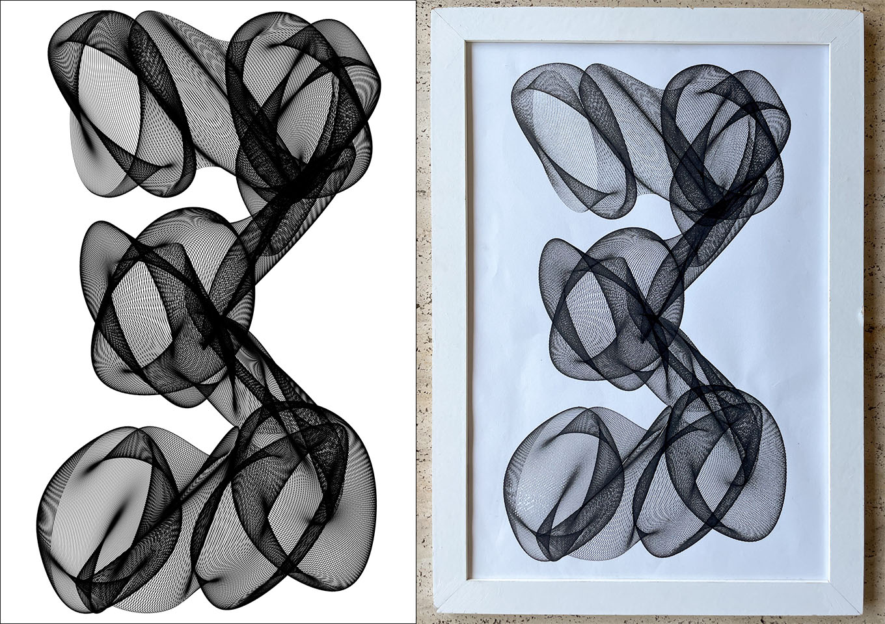
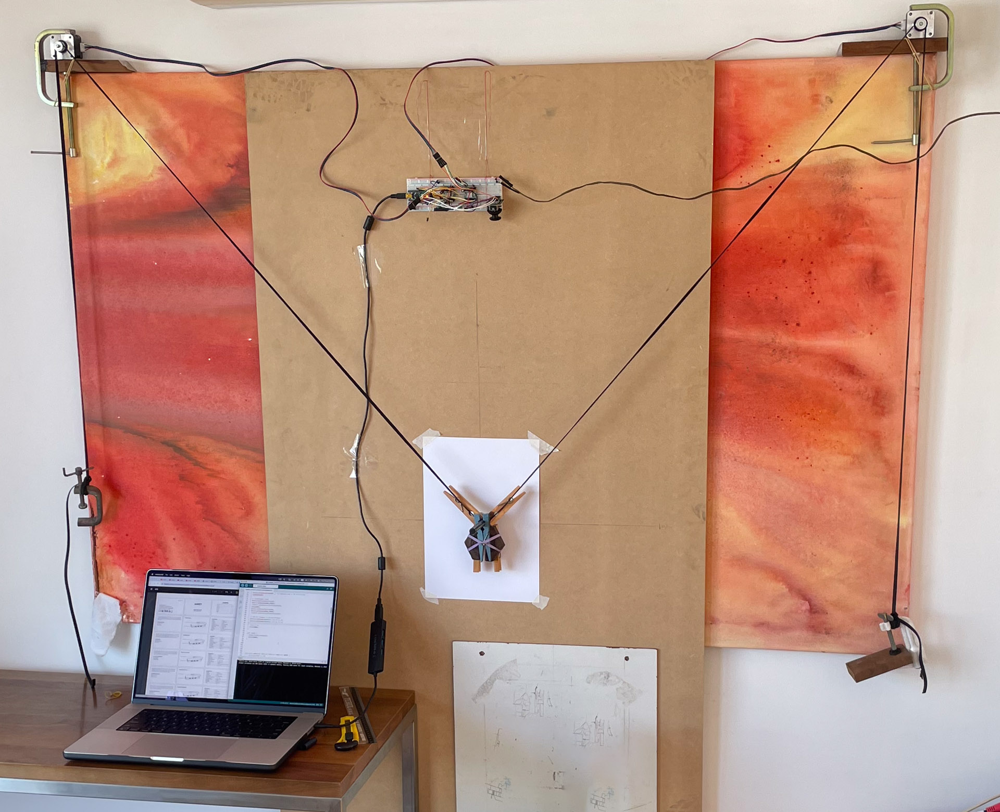

# Pen-Plotter-v1

This project is a homemade pen plotter designed and built from scratch. It utilizes an Arduino Nano microcontroller connected to two A4988 stepper motor drivers, which control NEMA 17 stepper motors. The motors are mounted on a wall and pull two toothed belts, each connected to the pen at the other end. By employing a mix of trigonometric functions, the plotter is capable of creating intricate patterns and artistic drawings.

{:width="300px"}

## Features
- **JavaScript Code**: The project includes a JavaScript file that utilizes the canvas-sketch module to provide a preview of the drawings in a browser environment.
- **Arduino Code**: Written in C/C++, the Arduino code controls the movement of the stepper motors and coordinates the drawing process.

## Usage
1. Install canvas-sketch with npm/npx. Run the JavaScript file "npx canvas-sketch-cli sketch02.js" in a browser to previsualize the drawings.
2. Upload the Arduino code to the Arduino Nano and copy the formula_x() and formula_y() functions to get the same results with the pen plotter.
3. Experiment with the trigonometric functions to create various patterns.

{:width="300px"}

## Repository Contents
- `stepper_nema17_sinCNC_accelstepper.ino`: Contains the Arduino code for controlling the pen plotter.
- `sketch_02.js`: Includes the JavaScript file for previsualizing drawings in the browser.

## Credits
This project was created by Gabor Gorondi.
